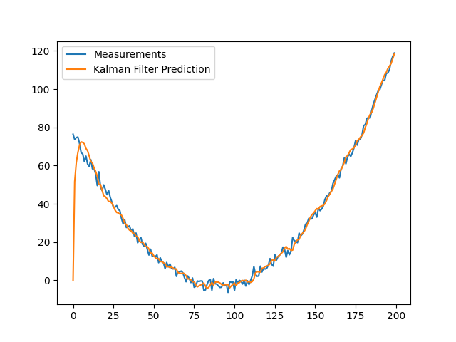

# Kalman Filters

## Introduction
Kalman filters track the estimated state of the system and its uncertainty. It uses a sequence of noisy observations from one or more sensors to better estimate the unknown quantity of interest (state) and the associated uncertainty (How sure we are?) at the current time instance.
It has many applications such as tracking the location and the velocity of a moving object using a LiDAR that measures the position only.

Kalman filter consists of two main steps the prediction step and the update step which are working recursively.

<b>Prediction Step:</b> In this step we predict the future state based on the current previous step, sometimes called the motion model.

<b>Update Step:</b> After we get a new observation from the sensors, we make the update step where we update our prediction state with this new information to correct the predicted state.

## Kalman Filter
You can find the implementation of the Kalman filter in `kalman_filter.py` file. 

The image plotting below shows the output of the Kalman filter Vs noisy measurements.

